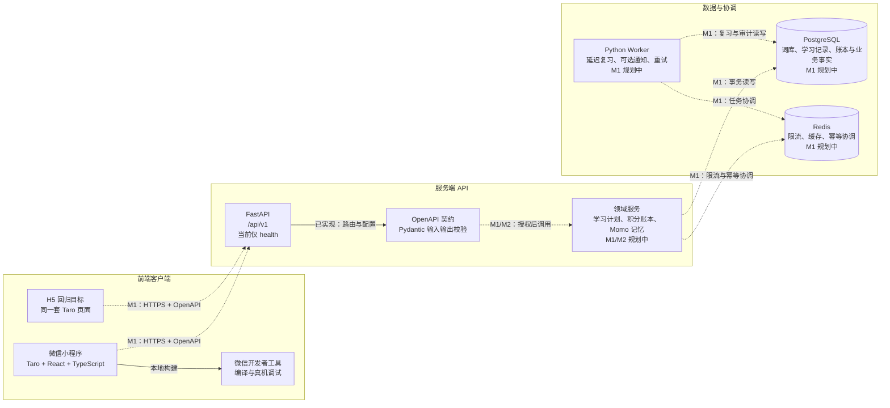
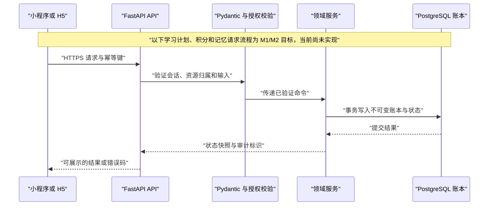
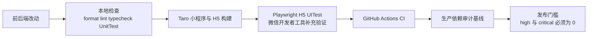

# English Pet Care Plan — 前后端架构图

> 更新日期：2026-08-22
> 目的：说明当前实现与 M1/M2 目标架构的边界。虚线标注的链路或组件尚未实现，不能视为可用功能。

## 1. 系统总览

### 当前实现状态

| 区域                        | 当前状态                                                | 责任边界                                                   |
| --------------------------- | ------------------------------------------------------- | ---------------------------------------------------------- |
| 微信小程序 / H5             | 已有 Taro React 页面、构建、UnitTest 和 H5 UITest 骨架  | 只负责展示、输入与请求状态；不能裁决积分、库存或宠物状态。 |
| FastAPI                     | 已有应用工厂、`/api/v1/health`、配置模型和 OpenAPI 入口 | 后续是所有业务规则的唯一权威。                             |
| PostgreSQL / Redis / Worker | 尚未接入                                                | 仅为 M1/M2 目标架构，当前没有可连接的业务数据源。          |

## 2. 业务请求与安全边界

安全规则：客户端不得本地结算积分、学习计划、复习、记忆、健康、疾病、死亡或排行榜。所有写入在服务端完成身份验证、资源归属校验、内容/状态校验和幂等控制后，才可进入账本或状态存储。

## 3. 开发与质量门禁

- `npm run verify:upgrade`：执行前端检查、小程序构建、H5 构建与 Playwright UITest。
- `npm run audit:prod:baseline`：阻止生产依赖审计风险超过当前基线。
- `npm run audit:prod:release`：当前会因 Taro 依赖的高风险审计结果而失败，因此公开发布仍被阻断。

## 4. 后续更新规则

当 M1 接入登录、词库、学习任务与积分账本时，应将虚线请求链路改为实线，并补充实际的认证方式、数据库迁移和错误码。当延迟复习调度接入后，再将 Worker 与 Redis 链路标记为已实现。详细架构说明见 [docs/architecture.md](docs/architecture.md)。
